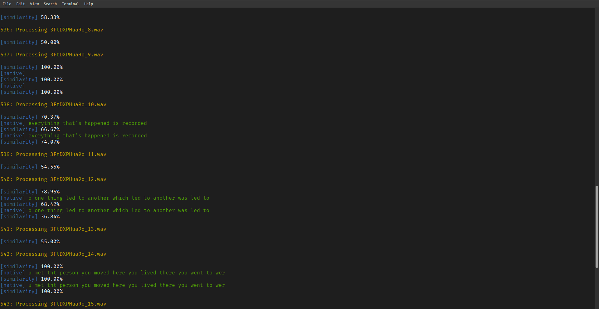
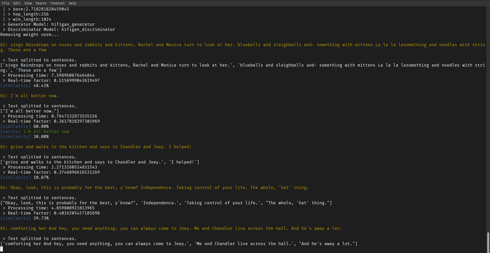

# mimicking - English Pronunciation Improvement App

This is a simple Python application powered by AI and designed to help you improve your English pronunciation by mimicking native speakers. The app runs locally, so your data never leaves your machine.



The core feature is a pronunciation comparison between your speech and the reference pronunciation from either an AI assistant or a source audio file. The similarity is calculated using the Word Error Rate (WER), which measures how close your pronunciation is to the reference.

### WER Scale

| **Range**         | **Description** | **Quality**                                                                      |
| ----------------- | --------------- | -------------------------------------------------------------------------------- |
| **0 - 20%**       | Excellent       | Very close to native pronunciation.                                              |
| **20 - 40%**      | Good            | Some minor mispronunciations, but generally understandable.                      |
| **40 - 60%**      | Fair            | Noticeable errors; pronunciation may sound foreign but is mostly understandable. |
| **60% and above** | Poor            | Significant pronunciation issues, making it difficult to understand.             |



### Features

-   Transcription: [Wav2Vec2 model](https://huggingface.co/docs/transformers/en/model_doc/wav2vec2).
-   Text-to-Speech: [Coqui.AI TTS](https://github.com/coqui-ai/TTS).
-   English Phonemes: [CMU Pronouncing Dictionary](https://github.com/cmusphinx/cmudict).
-   Data: Your performance data is stored in SQLite3 databases, with separate databases for each mode. Over time, this setup will allow you to query and analyze your progress effectively.

## Getting Started

### Environment Setup

The app is developed with Python 3.11.2 on Debian GNU/Linux 12 (Bookworm). If you're using a different OS, a Dockerfile is provided to help you run the app in an Debian-based container. Simply clone the repository and build/run the Docker image with a volume for your project.

Clone this repo and you'll can set up the app locally by following these commands:

```bash
python -m venv venv

. venv/bin/activate

pip install -r requirements.txt
```

Install [youtube-dl](https://github.com/ytdl-org/youtube-dl), if you wanna use youtube videos. You can use these commands:

```bash
sudo curl -L https://github.com/ytdl-org/ytdl-nightly/releases/download/2024.07.07/youtube-dl -o /usr/local/bin/youtube-dl

sudo chmod a+rx /usr/local/bin/youtube-dl
```

### Configuration

To personalize the setup, you'll need to configure a few variables in the settings.py file.

### Permissions

Ensure the scripts are executable by running:

```bash
chmod +x <script>
```

### Input Options

You can provide input in one of two ways:

1.  **Text File**: A file with one phrase per line.
2.  **Audio Folder**: A folder containing \*.wav audio files.

### Download and Split YouTube Audio:

The ./download_and_split_ytb <textfile.txt> script allows you to download audio from YouTube videos. It will split the audio into 3-second segments, which you can directly edit in the script. The text file should contain URLs to YouTube videos, one per line.

### Text File Format

The text file should contain one phrase per line. For example:

```bash
How are you today?
I am learning to speak English.
```

### Running the App

To run the app, use the following command in any shell:

```bash
python main.py --mode <audio | text>
```

### Troubleshooting

If you encounter any issues, please check the following:

1.  Ensure the necessary dependencies are installed.
2.  Verify your configuration in settings.py.
3.  Make sure the scripts have the appropriate executable permissions.
